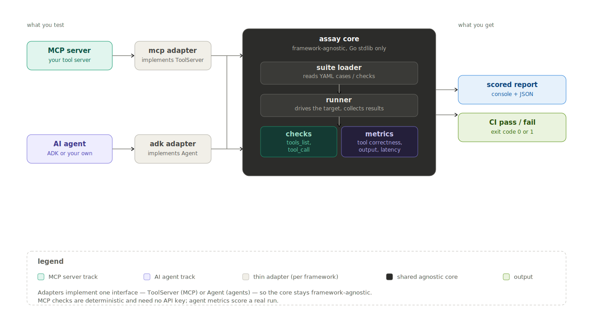

# assay

[](https://golang.org)
[](https://pkg.go.dev/github.com/tushariitr-19/assay)
[](https://goreportcard.com/report/github.com/tushariitr-19/assay)
[](https://codecov.io/gh/tushariitr-19/assay)
[](https://github.com/tushariitr-19/assay/actions)
[](LICENSE)

A framework-agnostic evaluation library and CLI for Go. Point `assay` at an **MCP server** or an **AI agent**, give it a suite of checks in YAML, and it scores whether the right tools were called, with the right arguments, fast enough, and producing the expected output — then fails your CI when something regresses.

Built on the official [Go MCP SDK](https://github.com/modelcontextprotocol/go-sdk) and tested against [Google ADK for Go](https://github.com/google/adk-go).

---

## Why assay?

The Go ecosystem has agent frameworks (ADK, eino, trpc-agent-go) and a first-class [MCP SDK](https://github.com/modelcontextprotocol/go-sdk) — but no standalone way to *evaluate* what you build with them. The evaluators that exist are **bundled into a single framework** and only test that framework's agents. If you ship an MCP server, there's nothing in Go that answers the everyday question: *does my server still expose the tools it claims, and do they still work?*

`assay` is that missing piece — a deterministic, framework-agnostic test harness for tool-using systems:

- **Framework-agnostic** — the core depends on nothing but the standard library. Anything that satisfies a tiny interface can be evaluated: MCP servers, ADK agents, or your own.
- **Deterministic** — MCP server checks need no LLM and no API keys. They run free, in CI, on every commit.
- **Minimal integration** — test an MCP server with zero Go code (a binary + a YAML). Test an agent with two lines.
- **CI-ready** — every run returns a proper exit code, so a failing suite breaks the build.
- **Open source** — MIT licensed.
- **Production grade** — keyless-testable core, structured reports (console + JSON), clean multi-module architecture.

---

## Architecture



`assay` is built as **two parallel tracks over one shared core.**

The **core** (the root `assay` package) is completely agnostic — it imports no framework SDK. It defines two contracts:

- `Agent` — anything with `Run(ctx, input) (Result, error)`. This is the *agent track*: give it a prompt, see which tools it chose and what it returned.
- `ToolServer` — anything with `ListTools(ctx)` and `CallTool(ctx, name, args)`. This is the *MCP track*: probe a server's contract directly, no LLM involved.

**Adapters** live in their own modules so their heavy dependency trees never reach the core:

- `adk/` wraps a Google ADK agent and satisfies `Agent`.
- `mcp/` wraps the official MCP SDK client and satisfies `ToolServer`.

Both tracks feed the **same shared machinery** — the runner, the scoring, the console/JSON reporters, the YAML suite loader, and the CLI with its exit codes. Adding support for a new framework (LangChain-Go, a vanilla LLM loop, another MCP transport) means writing one thin adapter against an existing interface — nothing in the core changes.

> The dependency arrow only ever points one way: adapters depend on the core's interfaces, never the reverse. If the core's `go.mod` ever needs to import an SDK, the boundary has been violated.

---

## What it evaluates

### MCP server checks (deterministic, no API key)

| Check | Description |
|-------|-------------|
| `tools_list` | Asserts the server exposes the expected set of tools |
| `tool_call` | Calls a tool with given args and asserts on the outcome — `expect_no_error`, `result_contains`, `max_latency` |

### Agent metrics

| Metric | Description |
|--------|-------------|
| `tool_correctness` | Did the agent call the expected tools (optionally ordered, with argument matching)? |
| `output_contains` | Does the response contain the expected substrings? |
| `output_regex` | Does the response match the expected patterns? |
| `max_latency` | Did the run complete within the latency ceiling? |

Each check/metric returns a score in `[0,1]`; a suite passes when the aggregate meets its threshold.

---

## Quickstart — test an MCP server (zero Go code)

Build your server to a binary, write a `checks.yaml`, and run `assay`. No integration code required.

```yaml
# checks.yaml
threshold: 1.0
checks:
  - name: lists_all_tools
    type: tools_list
    expect_tools: [get_visa_bulletin, check_priority_date, explain_term]

  - name: explain_term_works
    type: tool_call
    tool: explain_term
    args: { term: "priority date" }
    expect_no_error: true
    max_latency: 10s
```

```bash
assay mcp --server "./immigration-mcp-server" --suite checks.yaml
```

```text
CASE                      SCORE  RESULT
tools_list                1.00   ✓
  tools_list              1.00   3/3 expected tools exposed
tool_call:explain_term    1.00   ✓
  tool_call:explain_term  1.00   2/2 assertions passed
SUITE SCORE: 1.00   threshold 1.00   PASS
```

Exit code is `0` on pass, `1` on failure — drop it straight into a CI job.

---

## Quickstart — test an agent (a few lines of Go)

Agents are constructed in code, so you wrap your agent in the matching adapter, register it, and hand off to the assay CLI. Here, an ADK agent:

```go
package main

import (
    "github.com/tushariitr-19/assay/adk"
    "github.com/tushariitr-19/assay/cli/app"
)

func main() {
    adapter, _ := adk.New(rootAgent) // wrap your ADK agent
    app.SetAgent(adapter)            // register it
    app.Main()                       // hand off to the assay CLI
}
```

Build it and run the agent track through the CLI:

```bash
go build -o myeval .
./myeval agent --suite cases.yaml
```

```yaml
# cases.yaml
threshold: 0.80
cases:
  - name: search_recent_papers
    input: "Find recent papers on retrieval-augmented generation"
    expect_tools: [TopicSearchAgent]
    output_contains: ["RAG"]
    max_latency: 60s
```

```text
CASE                  SCORE  RESULT
search_recent_papers  1.00   ✓
  tool_correctness    1.00   1/1 expected tools called
  output_contains     1.00   1/1 substrings present
  max_latency         1.00   17527ms <= 60000ms
SUITE SCORE: 1.00   threshold 0.80   PASS
```

A runnable version lives in [`examples/research-agent/`](examples/research-agent), dogfooded against [research-agent-adk](https://github.com/tushariitr-19/research-agent-adk).

**Bring your own agent:** if you're not on ADK, implement the one-method `Agent` interface yourself — everything else (metrics, runner, reports, CLI) works unchanged.

```go
type MyAgent struct{ /* ... */ }

func (a MyAgent) Run(ctx context.Context, input string) (assay.Result, error) {
    // call your agent, return Output + the tool calls it made
}
```

You can also call the runner directly from a `_test.go` instead of building a CLI:

```go
adapter, _ := adk.New(rootAgent)
suite, _ := assay.LoadSuite("cases.yaml")
report := assay.Runner{}.Run(ctx, adapter, suite)
report.WriteText(os.Stdout)
```

---

## Prerequisites

- Go 1.25+
- For MCP server checks: **no API keys** — `assay` only talks to your server.
- For the agent example: whatever your agent needs (e.g. a Google AI Studio key for the ADK example).

---

## Install

```bash
# Library — to embed in Go tests or programs
go get github.com/tushariitr-19/assay

# CLI — to test MCP servers from the command line
go install github.com/tushariitr-19/assay/cli/cmd/assay@latest
```

The installed `assay` binary tests **MCP servers** out of the box (`assay mcp ...`). To test an **agent**, build your own binary that registers it via `app.SetAgent` — see the agent quickstart above — since agents are constructed in code.

---

## Project Structure

```
assay/
├── agent.go             ← Agent interface, Result, ToolCall
├── toolserver.go        ← ToolServer interface, ToolOutcome
├── metric.go            ← agent metrics (tool_correctness, output_contains, …)
├── check.go             ← MCP checks (tools_list, tool_call)
├── runner.go            ← agent runner
├── server_runner.go     ← MCP server runner
├── reporter.go          ← console + JSON reports (shared by both tracks)
├── suite_yaml.go        ← agent suite loader
├── server_yaml.go       ← MCP suite loader
├── config/              ← run configuration
├── logger/              ← structured logging via zap
├── internal/
│   ├── fakeagent/       ← keyless agent for tests
│   └── faketoolserver/  ← keyless server for tests
├── adk/                 ← ADK adapter (own module)
├── mcp/                 ← MCP adapter (own module)
├── cli/                 ← the assay binary (own module)
│   ├── app/             ← importable CLI: SetAgent, Main
│   └── cmd/assay/       ← the assay binary entry point
├── examples/
│   └── research-agent/  ← ADK dogfood example
├── tests/               ← integration tests
└── docs/                ← architecture diagram + screenshots
```

This is a **multi-module repository**: the root is the agnostic core library; `adk`, `mcp`, and `cli` are separate modules so their SDK dependencies stay out of the core.

---

## Makefile Targets

```bash
make build             # Build the assay CLI binary
make test              # Unit tests (keyless, no network)
make test-integration  # Integration tests (spawns real servers / agents)
make test-all          # All tests
make lint              # go vet + gofmt check
make clean             # Remove build artifacts
```

---

## Design Decisions

**Agnostic core, thin adapters** — the core knows two interfaces and nothing about ADK or MCP. Framework specifics live in dedicated modules, so the published library stays dependency-light and any new framework is a small additive adapter.

**Keyless, deterministic core** — every metric and check is unit-tested against in-memory fakes (`fakeagent`, `faketoolserver`) with no network or credentials, so the whole core runs green in CI for free.

**MCP testing is contract testing, not LLM testing** — an MCP server doesn't decide anything; it provides tools. So `assay` probes it directly (`tools/list`, `tools/call`) rather than putting a model in the loop. Deterministic, cheap, and exactly what "does my server work?" means.

**Two tracks, one report** — the agent runner and the server runner produce the identical report structure, so the console/JSON reporters and CI exit codes are shared, untouched, across both.

**Transport vs. tool errors are distinct** — a crashed connection surfaces as a Go error; a tool that ran but reported failure surfaces as `IsError`, scored by the `expect_no_error` check. The two are never conflated.

---

## Roadmap

- [x] MCP server evaluation — `tools_list` and `tool_call` checks
- [x] Agent evaluation — tool correctness, output contains/regex, latency
- [x] Official MCP SDK adapter (stdio transport)
- [x] Google ADK adapter
- [x] Unified `assay` CLI with CI exit codes
- [x] Console + JSON reports, YAML suites
- [x] `assay agent` subcommand via register-and-build (app.SetAgent + Main)
- [ ] LLM-as-judge metric for response quality (behind a pluggable `Judge` interface)
- [ ] Nested trajectory granularity — score leaf tool calls inside sub-agents, not just root routing
- [ ] MCP `resources` and `prompts` checks
- [ ] MCP HTTP transport (in addition to stdio)
- [ ] More adapters — LangChain-Go, vanilla LLM loops
- [ ] Synthetic test-case generation

---

## Contributing

PRs welcome. To support a new framework, you only write an adapter:

1. Create a new module (e.g. `langchain/`) with its own `go.mod`.
2. Implement either `assay.Agent` (for agents) or `assay.ToolServer` (for tool servers).
3. Translate the framework's output into `assay.Result` / `assay.ToolOutcome`.
4. Add an example under `examples/` and an integration test under `tests/`.

The core never needs to change.

---

## License

MIT — see [LICENSE](LICENSE) for details.

## Acknowledgements

- [Model Context Protocol Go SDK](https://github.com/modelcontextprotocol/go-sdk) — the official Go MCP SDK.
- [Google ADK](https://github.com/google/adk-go) — Agent Development Kit for Go.